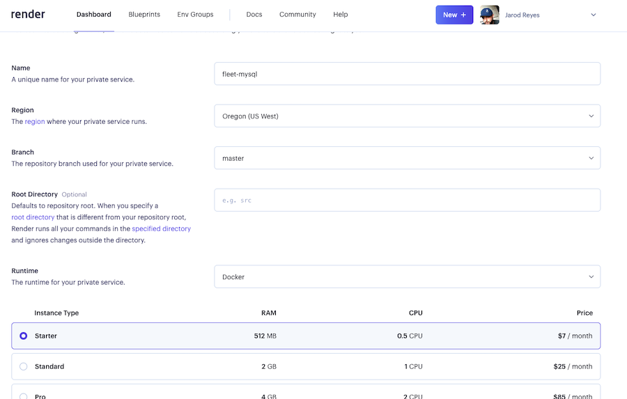
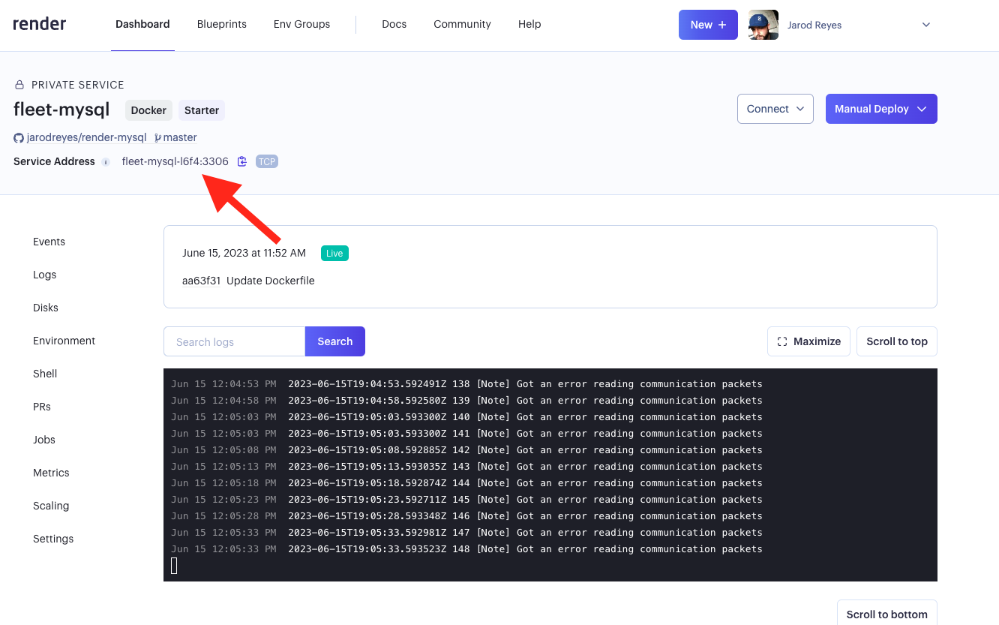
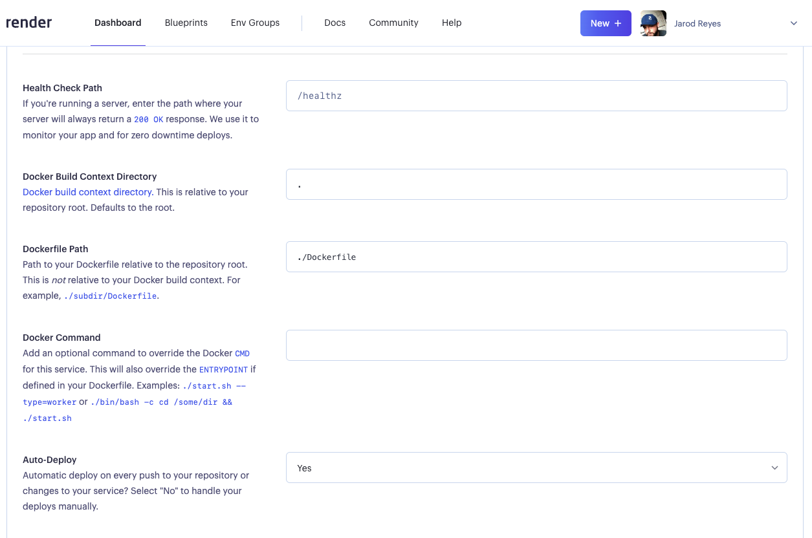

# Deploy Fleet on Render

[Render](https://render.com/) is a cloud hosting service that makes it dead simple to get things up and running fast, without the typical headache of larger enterprise hosting providers. Hosting Fleet on Render is a cost effective and scalable cloud environment with a lower barrier to entry, making it a great place to get some experience with [Fleet](https://fleetdm.com/) and [osquery](https://osquery.io/).

---

Below we’ll look at how to deploy Fleet on Render using Render WebService & Private Service components. To complete this you’ll need an account on Render, and about 30 minutes.

Fleet only has 2 external dependencies:

- MySQL 5.7
- Redis 6

First let’s get these dependencies up and running on Render.

---

## MySQL

Fleet uses MySQL as the datastore to organize host enrollment and other metadata around serving Fleet. Start by forking [https://github.com/edwardsb/render-mysql](https://github.com/edwardsb/render-mysql), then create a new private service within Render. When prompted for the repository — enter your fork’s URL here.


*Private Service component in Render*

Your private service should look like this:

*Private Service settings in Render*

This private service will run MySQL, our database, so let’s give it a fitting name, something like “fleet-mysql”.

We’re also going to need to set up some environment variables and a disk to mount. Expand “Advanced” and enter the following:

### Environment Variables

- `MYSQL_DATABASE=fleet`
- `MYSQL_PASSWORD=supersecurepw`
- `MYSQL_ROOT_PASSWORD=supersecurerootpw`
- `MYSQL_USER=fleet`

### Disks

- Name: `mysql`
- Mount Path: `/var/lib/mysql`
- Size: `50GB`

Once you've setup your mysql service on Render we will need to copy the address. You can find that here:

*mysql address on Render*

---

## Redis

The next dependency we’ll configure is Redis. Fleet uses Redis to ingest and queue the results of distributed queries, cache data, etc. Luckily for us the folks over at Render have a ready-to-deploy Redis template that makes deploying Redis as a private service a single mouse click. Check out [https://render.com/docs/deploy-redis](https://render.com/docs/deploy-redis).

After it’s deployed, you should see a unique Redis host/port combination, we’ll need that for Fleet so make sure to copy it for later.

---

## Fleet

Now that we have the dependencies up and running, on to Fleet!

Start by forking or use [https://github.com/edwardsb/fleet-on-render](https://github.com/edwardsb/fleet-on-render) directly. This Dockerfile is based on Fleet, but overrides the default command to include the migration step, which prepares the database by running all required migrations. Normally it’s best to do this as a separate task, or job that runs before a new deployment, but for simplicity we can have it run every time the task starts.

Back in Render, create a new web service and give it a unique name, since this will be resolvable on the internet, it actually has to be unique on Render’s platform.


*Web Service component in Render*

Next we will supply the environment variables Fleet needs to connect to the database and redis. We are also going to disable TLS on the Fleet server, since Render is going to handle SSL termination for us.

Give it the following environment variables:

- `FLEET_MYSQL_ADDRESS=fleet-mysql:3306`(your unique service address)
- `FLEET_MYSQL_DATABASE=fleet`
- `FLEET_MYSQL_PASSWORD=supersecurepw`
- `FLEET_MYSQL_USERNAME=fleet`
- `FLEET_REDIS_ADDRESS=fleet-redis:10000` (your unique Redis host:port from earlier)
- `FLEET_SERVER_TLS=false` (Render takes care of SSL termination)

Additionally we’ll configure the following so Render knows how to build our app and make sure its healthy:



- Health Check Path: `/healthz`
- Docker Build Context Directory: `.`
- Dockerfile Path: `./Dockerfile`

Click Create and watch Render deploy Fleet! You should see something like this in the event logs:

```
Migrations completed.
ts=2021–09–15T02:09:07.06528012Z transport=http address=0.0.0.0:8080 msg=listening
```

Fleet is up and running, head to your public URL.


*Fleet deployed on Render*

---

## Setup Fleet and enroll hosts

You should be prompted with a setup page, where you can enter your name, email, and password. Run through those steps and you should have an empty hosts page waiting for you.

You’ll find the enroll-secret after clicking “Add New Hosts”. This is a special secret the host will need to register to your Fleet instance. Once you have the enroll-secret you can use `fleetctl` to create Orbit installers, which makes installing and updating osquery super simple.

To install `fleetctl`, which is the command line interface (CLI) used to communicate between your computer and Fleet, you either run `npm install -g fleetctl` or [download fleetctl](https://github.com/fleetdm/fleet/releases/tag/fleet-v4.3.0) from Github. Once it's installed try the following command (Docker require) on your terminal:

```
fleetctl package --type=msi --enroll-secret <secret> --fleet-url https://<your-unique-service-name>.onrender.com
```

This command creates an `msi` installer pointed at your Fleet instance.

Now we need some awesome queries to run against the hosts we enroll, check out the collection [here](https://github.com/fleetdm/fleet/tree/main/docs/01-Using-Fleet/standard-query-library).

To get them into Fleet we can use `fleetctl` again. Run the following on your terminal:

```
curl https://raw.githubusercontent.com/fleetdm/fleet/main/docs/01-Using-Fleet/standard-query-library/standard-query-library.yml -o standard-query-library.yaml
```

Now that we downloaded the standard query library, we’ll apply it using `fleetctl`. First we’ll configure `fleetctl` to use the instance we just built.

Try running:

```
fleetctl config set --address https://<your-unique-service-name>.onrender.com
```

Next, login with your credentials from when you set up the Fleet instance by running `fleetctl login`:

```
fleetctl login
Log in using the standard Fleet credentials.
Email: <enter user you just setup>
Password:
Fleet login successful and context configured!
```

Applying the query library is simple. Just run:

```
fleetctl apply -f standard-query-library.yaml
```

`fleetctl` makes configuring Fleet really easy, directly from your terminal. You can even create API credentials so you can script `fleetctl` commands, and really unlock the power of Fleet.

That’s it! We have successfully deployed and configured a Fleet instance! Render makes this process super easy, and you can even enable auto-scaling and let the app grow with your needs.


<meta name="category" value="deploy">
<meta name="authorGitHubUsername" value="edwardsb">
<meta name="authorFullName" value="Ben Edwards">
<meta name="publishedOn" value="2021-11-21">
<meta name="articleTitle" value="Deploy Fleet on Render">
<meta name="articleImageUrl" value="../website/assets/images/articles/deploying-fleet-on-render-cover-1600x900@2x.jpg">
